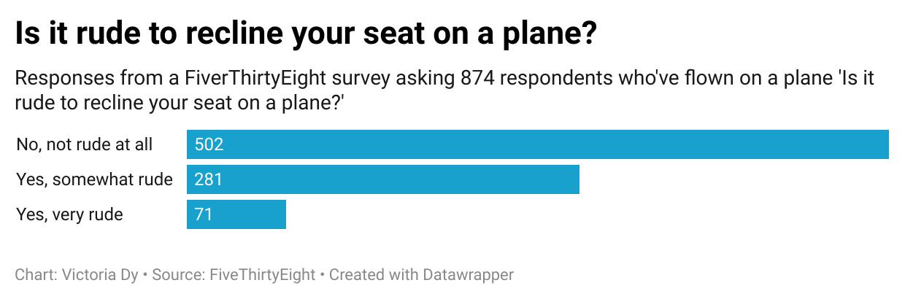

# QUIZ 4 #

### I chose the question 'Is it rude to recline your seat on a plane?' :airplane: because I thought it was a very interesting question which binary answers. People can either hate it :unamused: when the person in front reclines or don't care :no_mouth: . As I am someone who occassionally does recline her seat :see_no_evil: but also feels guilty when I do :grimacing:, I wanted to know how bothered people really are. It's interesting to see the responses and how many people really are bothered.

### The results showed that 352 people out of 871 people were bothered by reclining seats. That's about 41% of the respondents. :exclamation: Only 502 people said 'No, not at all.':star2:

